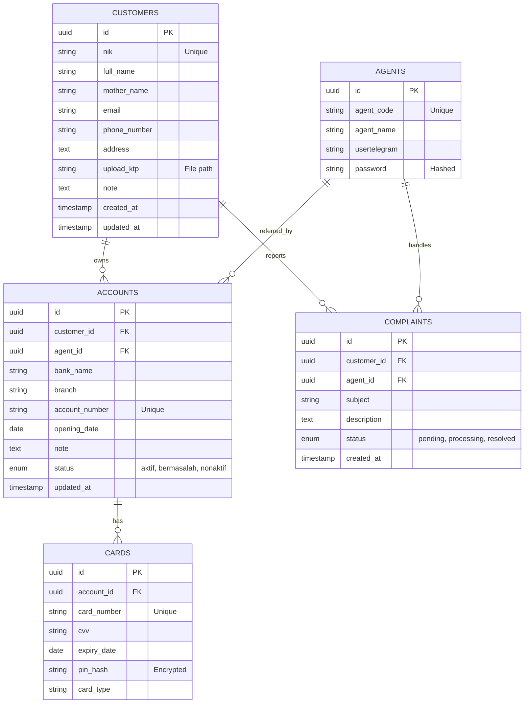

# Bank Account Management System Planning

## Overview
Build a Bank Account Management System using **Laravel 12 (latest)** and **Livewire**. The application is designed to manage sensitive customer data, multiple bank accounts, and ATM cards under an agent-referral system.

## Database Schema (ER Diagram)

## Technical Specifications & Requirements

### 1. Model & Migration Guidelines
- **Primary Key**: Use UUID for all tables.
- **Timestamps**: All tables must include `created_at` and `updated_at`.
- **Storage**: `upload_ktp` should store a relative path using Laravel's Storage facade.

### 2. Backend Framework
- **Framework**: Laravel 12.
- **Admin Panel**: Filament PHP v4 (for rapid CRUD development).
- **Authentication**: Default Laravel Auth for Agents (use `AGENTS` table as the provider if possible).

### 3. Core Features to Generate
- **Customer Resource**: CRUD for personal data including file upload for KTP.
- **Account Resource**: CRUD for bank accounts. Must be linkable to a Customer and an Agent.
- **Card Management**: Inline relationship in Account Resource or separate CRUD to manage multiple ATM cards per account.
- **Help Desk**: Ticketing system for Complaints where Agents can update status.

## LLM Execution Instructions (Step-by-Step)

Instructions for Cursor/IDE: Please execute the following tasks based on the schema above:

1.  **Environment Setup**: Create migrations for all tables using UUID.
2.  **Models**: Generate Models for `Customer`, `Account`, `Card`, `Agent`, and `Complaint`. Define the relationships (`HasMany`, `BelongsTo`).
3.  **Security Implementation**: In the `Card` model, implement encryption for `cvv` and `pin_hash`.
4.  **Filament Resources**:
    -   Create `CustomerResource` with FileUpload for KTP.
    -   Create `AccountResource` with a Select for Customer and Agent.
    -   Create `CardResource` or a RelationManager inside `AccountResource`.
    -   Create `ComplaintResource` with a status badge (pending = gray, processing = blue, resolved = green).
5.  **UI/UX**: Ensure all tables have a Search and Filter feature, especially for NIK, Account Number, and Agent Code.

## Specific Data Sample for Testing

-   **Customer**: Wimpi Gindasari
    -   **NIK**: `3213096212020011`
-   **Bank**: MANDIRI
    -   **Account**: `1250016567422`
    -   **Branch**: Subang
    -   **Date**: 22 Dec 2002
