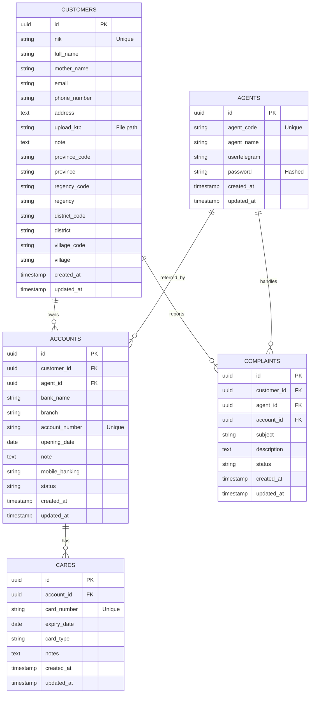

# Bank Account Management System Planning

## Overview
Build a Bank Account Management System using **Laravel 12 (latest)** and **Livewire**. The application is designed to manage sensitive customer data, multiple bank accounts, and ATM cards under an agent-referral system.

## Database Schema (ER Diagram)

## Technical Specifications & Requirements

### 1. Model & Migration Guidelines
- **Primary Key**: Use UUID for all tables.
- **Timestamps**: All tables must include `created_at` and `updated_at`.
- **Storage**: `upload_ktp` should store a relative path using Laravel's Storage facade.
- **Regional Data**: `CUSTOMERS` table includes province, regency, district, and village columns (both code and name).

### 2. Backend Framework
- **Framework**: Laravel 12.
- **Admin Panel**: Filament PHP v4 (for rapid CRUD development).
- **Authentication**: Default Laravel Auth for Agents (use `AGENTS` table as the provider if possible).

### 3. Core Features to Generate
- **Customer Resource**: CRUD for personal data including file upload for KTP.
- **Account Resource**: CRUD for bank accounts. Must be linkable to a Customer and an Agent.
- **Card Management**: Inline relationship in Account Resource or separate CRUD to manage multiple ATM cards per account.
- **Help Desk**: Ticketing system for Complaints where Agents can update status.

## LLM Execution Instructions (Step-by-Step)

Instructions for Cursor/IDE: Please execute the following tasks based on the schema above:

1.  **Environment Setup**: Create migrations for all tables using UUID.
2.  **Models**: Generate Models for `Customer`, `Account`, `Card`, `Agent`, and `Complaint`. Define the relationships (`HasMany`, `BelongsTo`).
3.  **Security Implementation**: Sensitive data like `cvv` and `pin` are removed from `CARDS` table; use the `notes` field to store sensitive information securely.
4.  **Filament Resources**:
    -   Create `CustomerResource` with FileUpload for KTP and regional data fields.
    -   Create `AccountResource` with a Select for Customer and Agent, and include Mobile Banking field.
    -   Create `CardResource` or a RelationManager inside `AccountResource`. Use `notes` field for sensitive data.
    -   Create `ComplaintResource` with a status badge (pending = gray, processing = blue, resolved = green) and link to Account.
5.  **UI/UX**: Ensure all tables have a Search and Filter feature, especially for NIK, Account Number, and Agent Code.

## Specific Data Sample for Testing

-   **Customer**: Wimpi Gindasari
    -   **NIK**: `3213096212020011`
-   **Bank**: MANDIRI
    -   **Account**: `1250016567422`
    -   **Branch**: Subang
    -   **Date**: 22 Dec 2002

## Database Changes Notes

### Changes from Original Schema:

1. **CUSTOMERS Table**:
   - Added regional data columns: `province_code`, `province`, `regency_code`, `regency`, `district_code`, `district`, `village_code`, `village`

2. **ACCOUNTS Table**:
   - Added `created_at` timestamp
   - Added `mobile_banking` column (text) for mobile banking information
   - Status is stored as `varchar` instead of `enum`

3. **CARDS Table**:
   - **IMPORTANT**: Removed `cvv` and `pin` columns for security reasons
   - Replaced with `notes` column (text) to store sensitive information securely
   - Added `created_at` and `updated_at` timestamps

4. **AGENTS Table**:
   - Added `created_at` and `updated_at` timestamps

5. **COMPLAINTS Table**:
   - Added `account_id` foreign key to link complaints to specific accounts
   - Added `updated_at` timestamp
   - Status is stored as `varchar` instead of `enum`

### Security Notes:
- Sensitive card data (CVV, PIN) should be stored securely in the `notes` field with proper encryption if needed
- All foreign keys have appropriate cascade/delete behaviors:
  - `accounts.customer_id`: CASCADE on delete
  - `accounts.agent_id`: SET NULL on delete
  - `cards.account_id`: CASCADE on delete
  - `complaints.customer_id`: CASCADE on delete
  - `complaints.agent_id`: SET NULL on delete
  - `complaints.account_id`: CASCADE on delete
